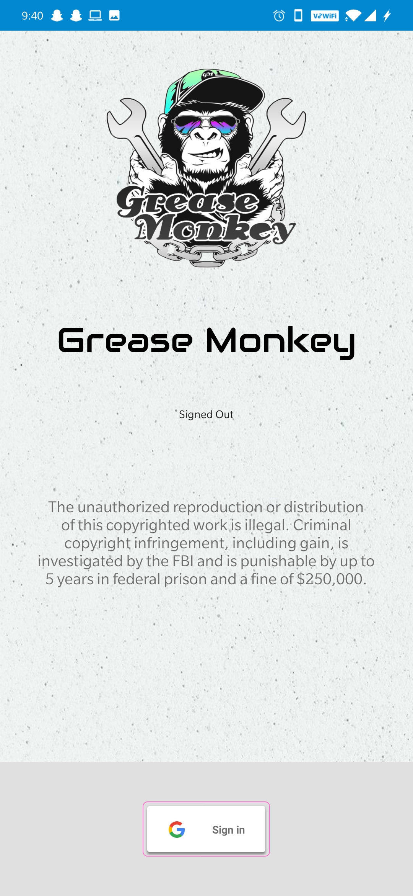

  <h1>Grease Monkey</h1>
  

---
## Tech Stack-

 

 

 

 

---

- Grease Monkey Android Application
 
- 44+ international companies data used.
 
- Tech used- “Firebase: Authentication, Realtime Database, Google Maps API”
 
- Automobile Service providing App
 
---

## POWER TO USER
* Data available for **40+ international automobile companies**.
* **Market price** for car parts and accessories.
* Can also link you with the **companies official website**.
* Can also show you the **nearby service providers**.
* On one can click you can get the **fastest route** from your location to the nearby service provider.
---
    

  

Connects you with the nearby service provider.

Security:
Verified by Google Security Services.
Authenticated by Google Firebase.
Creates logs and maintains analytics in Firebase.

Connects you with the service providers.
You just need to knowwhat you need, and the application will tell at what price and where you will get the product

DATABASE
GOOGLE MAPS
SECURITY

mid-term MINI PROJECT
