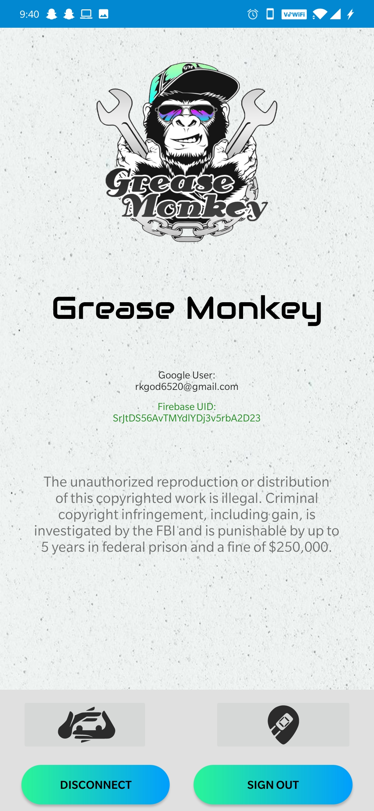
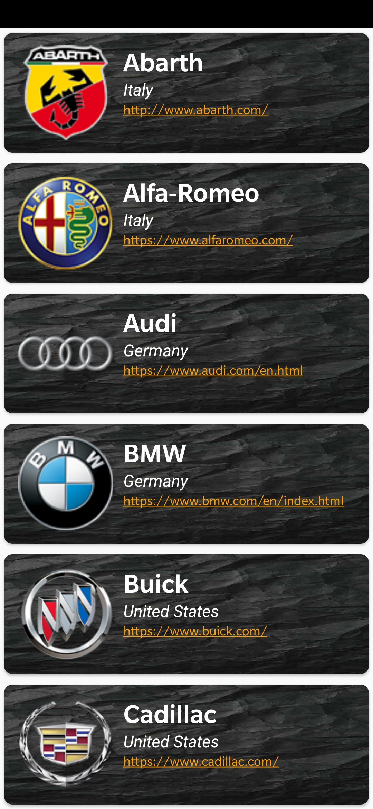
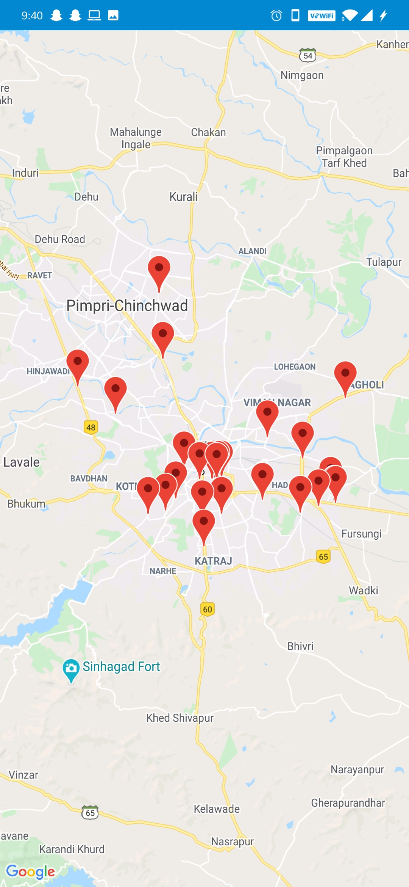

**_ACADEMIC PROJECT 2020 - 2021_**
<base target="_blank">

  <h1>Grease Monkey</h1>
  

---

## Tech Stack-

 

 

 

 

---

## POWER TO USER

- Grease Monkey Android Application
- 44+ international companies data used.
- Tech used- “Firebase: Authentication, Realtime Database, Google Maps API”
- Automobile Service providing App

---

## AUTHENTICATION

###Security:

- Verified by **Google Security Services**.
- Authenticated by **Google Firebase**.
- Creates **logs** and maintains **analytics** in Firebase.

  

---

## USER INTERFACE

ONE CLICK SOLUTION

- Shows user Logged email account.
- easy clicks to access database and map interface.
- Allows user to Sign Out / Disconnect from the Application

  

---

## DATABASE & MAPS

  
  

Database

- Data available for 40+ international automobile companies.
- Market price for car parts and accessories.
- Can also link you with the companies official website.

Google Maps

- Can also show you the nearby service providers.
- On one can click you can get the fastest route from your location to the nearby service provider.

---
[**Click Here to see Video Demonstration (01:45)**](https://drive.google.com/file/d/1Z-cGFchU4nxIjDuNm4CxwwK5cN4ddzBS/view)
<!--
<h3>
<a herf = "https://drive.google.com/file/d/1Z-cGFchU4nxIjDuNm4CxwwK5cN4ddzBS/view" > Click Here to see Video Demonstration (01:45)</a>
</h3>
-->
**_Contributors:_**
Kiran Lambate ;
Harshal Nikam
